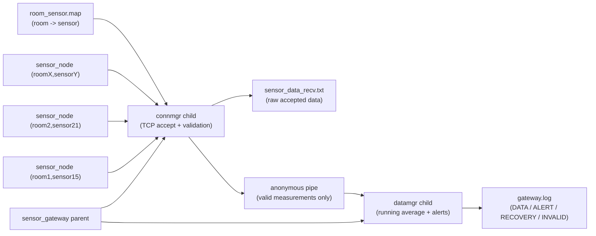

# Sensor Gateway (C, TCP, Multi-Sender)

This project simulates a sensor gateway system:
- multiple TCP senders (`sensor_node`) push sensor measurements,
- one receiver (`sensor_gateway`) accepts and validates data,
- data is passed between dedicated child processes,
- results are written into logs with running average and hot/cold alerts.

The project is designed for multi-terminal debugging in VSCode or terminal.

## 1) Core Behavior

- Sender input is **explicit**: `room + sensor + interval + ip + port (+ optional loops)`.
- Receiver accepts data only when `(room, sensor)` exists in `room_sensor.map`.
- Invalid `(room, sensor)` pairs are rejected immediately.
- Sender default loop mode is **infinite** (keeps sending until manually stopped).
- Receiver exits automatically if no data is received for `TIMEOUT` seconds.

## 2) Architecture Map



### Module Responsibilities

- `connmgr.c`
  - runs as a child process of `sensor_gateway`,
  - opens TCP server and accepts multiple senders concurrently,
  - forks one worker process per sender connection,
  - validates `(room, sensor)` against `room_sensor.map`,
  - rejects invalid pairs and closes that sender connection,
  - writes valid measurements to `sensor_data_recv.txt`,
  - forwards valid measurements to datamgr through a pipe,
  - enforces receiver idle timeout (`N sec without data`).

- `datamgr.c`
  - runs as a child process of `sensor_gateway`,
  - consumes measurements from the pipe,
  - maintains running average (`RUN_AVG_LENGTH` window),
  - emits `ALERT`/`RECOVERY` logs when state changes,
  - writes normalized `DATA` lines to `gateway.log`.

- `sensor_nodes.c`
  - sends `(sensor_id, room_id, value, timestamp)` to receiver,
  - supports floating sleep interval (e.g. `0.001`),
  - loops forever by default; optional finite loops for tests.

## 3) Data Contract

### `room_sensor.map`

Format is:
```txt
<room_id> <sensor_id>
```

Example:
```txt
1 15
2 21
3 37
4 49
```

### Sender Command

```bash
./sensor_node <ROOM> <SENSOR> <SLEEP_SEC> <SERVER_IP> <SERVER_PORT> [LOOPS]
```

- If `LOOPS` is omitted: uses default (`0`) = infinite send.
- If `LOOPS=0`: infinite send.
- If `LOOPS>0`: finite send and exit after that count.

### Receiver Command

```bash
./sensor_gateway <PORT> [IDLE_TIMEOUT_SECONDS]
```

- `IDLE_TIMEOUT_SECONDS=0` means listen forever.
- Positive timeout means auto-exit when no new data arrives for that period.

## 4) Build & Run

```bash
make clean
make
```

### Multi-terminal demo

Terminal A:
```bash
./sensor_gateway 5691 30
```

Terminal B:
```bash
./sensor_node 1 15 0.2 127.0.0.1 5691
```

Terminal C:
```bash
./sensor_node 2 21 0.2 127.0.0.1 5691
```

Terminal D (invalid pair test):
```bash
./sensor_node 1 10 0.2 127.0.0.1 5691
```

Expected for Terminal D:
- sender stops automatically (connection closed by receiver),
- `gateway.log` contains `REJECT_INVALID_PAIR room=1 sensor=10 ...`.

## 5) Logs

- `sensor_data_recv.txt`
  - raw accepted stream from connmgr,
  - format: `room sensor value timestamp`.

- `gateway.log`
  - lifecycle and processed records:
  - `START ...`
  - `DATA ...`
  - `ALERT ...` / `RECOVERY ...`
  - `REJECT_INVALID_PAIR ...`
  - `STOP ...`

## 6) Notes

- If a sender "disconnects suddenly", check:
  - whether `LOOPS` was finite,
  - whether `(room, sensor)` is invalid and got rejected,
  - whether receiver timed out due to no incoming data.
